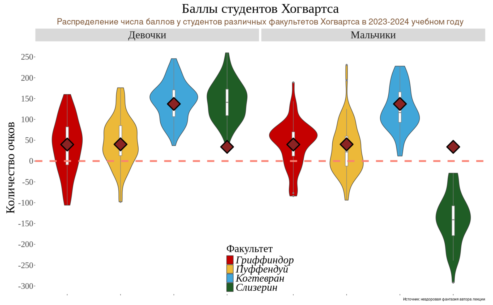

```{r setup, include=FALSE}
knitr::opts_chunk$set(echo = TRUE, message = FALSE, warning = FALSE, error = FALSE, fig.width = 12, fig.height = 6)

library(tidyverse)
library(dplyr)
library(ggpubr)
library(grid) 
library(forcats)
```

```{r dataLoading}
hogwarts <- read_csv("hogwarts_2024.csv")
hogwarts %>% head()
```

```{r}
theme_custom <- theme(
  panel.background = element_rect(fill = "white", colour = NA),
  plot.background = element_rect(fill = "white", colour = NA),
  panel.grid.major = element_line(colour = "grey90"),
  panel.grid.minor = element_blank(),
  panel.border = element_rect(colour = "black", fill = NA),
    axis.text = element_text(size = 18),
    axis.title = element_text(size = 22),
    legend.title = element_text(size = 22),
    legend.text = element_text(size = 18),
  strip.text = element_text(size = 18)
)
```

## Диаграммы рассеяния (скаттерплоты)

1.  Постройте скаттерплот, визуализирующий связь между суммарным баллом студента за год и оценкой за экзамен по травологии. Добавьте на график линию тренда. Удалите доверительную область и сделайте линию прямой. Подумайте, как избежать того, чтобы записать одни и те же координаты x и y дважды. Проинтерпретируйте график. (1 б.)

```{r}
hogwarts %>% 
  ggplot()+
  geom_point(aes(x = `result`, 
                 y = `Herbology exam`),
             position = position_jitter(width = 2, height = 2),
             shape = 21,
             fill = "#999999",
             alpha = 0.4)+
  geom_smooth(aes(x = `result`,
                  y = `Herbology exam`),
             colour = "#E41A1C",
             se = FALSE,
             method = "lm")+
  ggtitle("Связь между суммарным баллом и оценкой за травологию") +
  theme_custom
```

### Диаграммы рассеяния 1. Интерпритация

Линия тренда показывает, что существует положительная линейная корреляция между суммарным баллом студента за год и оценкой за экзамен по травологии.

2.  Отобразите на одном графике скаттерплоты, аналогичные тому, что вы делали на первом задании, для экзаменов по травологии, магловедению, прорицаниям и зельеварению. На графике так же должна присутствовать линия тренда с характеристиками, аналогичными тем, что были в пункте 1. Раскрасьте точки на графике в разные цвета, в соответствии с факультетами. Используйте стандартные цвета факультетов (как в лекционных rmd). Проинтерпретируйте график. (1 б). Если вы создадите график из этого пункта, используя только пакеты семейства tidyverse, и не привлекая дополнительные средства, вы получите дополнительные 0.5б.

```{r}
hogwarts_mod <- hogwarts %>% 
  pivot_longer(cols = c(`Herbology exam`, `Muggle studies exam`, `Divinations exam`, `Potions exam`), 
               names_to = "subject", 
               values_to = "value")
hogwarts_mod %>%   
  ggplot() +
  geom_point(aes(x = `result`, 
                 y = value, 
                 fill = house),
             position = position_jitter(width = 2, height = 2), 
             shape = 21, stroke = 0)+
  geom_smooth(aes(x = `result`, 
                  y = value, 
                  colour = subject),
                  se = FALSE, 
                  method = "lm")+
  
  scale_colour_manual(values = c("Herbology exam" = "#d9d9d9", 
                                 "Muggle studies exam" = "#969696", 
                                 "Divinations exam" = "#525252", 
                                 "Potions exam" = "#000000"))+
  
  scale_fill_manual(values = c("Gryffindor" = "#C50000","Hufflepuff" = "#ECB939", 
                               "Ravenclaw" = "#41A6D9","Slytherin" = "#1F5D25"))+
  
  labs(colour = "subject", fill = "house")+

  theme_custom
```

Вариант с фасетированием:

```{r}
hogwarts_mod <- hogwarts %>% 
  pivot_longer(cols = c(`Herbology exam`, `Muggle studies exam`, `Divinations exam`, `Potions exam`), 
               names_to = "subject", 
               values_to = "value")
hogwarts_mod %>%   
  ggplot() +
  geom_point(aes(x = `result`, 
                 y = value, 
                 fill = house),
             position = position_jitter(width = 2, height = 2), 
             shape = 21, stroke = 0)+
  
  geom_smooth(aes(x = `result`, 
                  y = value),
              colour = "#E41A1C",
              se = FALSE, 
              method = "lm")+
  
  scale_fill_manual(values = c("Gryffindor" = "#C50000","Hufflepuff" = "#ECB939", 
                               "Ravenclaw" = "#41A6D9","Slytherin" = "#1F5D25"))+
  
  labs(colour = "subject", fill = "house")+
  
  facet_wrap(vars(subject))+

  theme_custom
```

### Диаграммы рассеяния 2. Интерпритация

Для экзаменов по травологии, магловедению и прорицаниям наблюдается положительная корреляция между результатом за экзамен и суммарным баллом студента за год. Для экзамена по зельеварению напротив, наблюдается слабая отрицательная корреляция. Возможно, тут есть вклад результатов за экзамен у факультета Слизерин, потому что видно, что вне зависимости от суммарного балла студента за год большая часть студентов получила высокий балл по зельеварению.

3.  Видоизмените предыдущий график. Сгруппируйте и покрасьте линии тренда в соответствии с одной из категориальных переменных (с такой, которая подсвечивает одно из наблюдений на предыдущем этапе, относящееся ко всем 4-м экзаменам). Постарайтесь избежать коллизий в легенде, при этом сохранив и цветовую палитру для раскраски точек по факультетам. (1 б.)

**Греппировка по переменной пол:**

```{r}
hogwarts_mod %>%   
  ggplot() +
  geom_point(aes(x = `result`, 
                 y = value, 
                 colour = house, fill = house), 
             position = position_jitter(width = 2, height = 2), 
             shape = 21, stroke = 0) + 
             
  geom_smooth(aes(x = `result`, 
                  y = value, 
                  colour = sex), 
              se = FALSE, 
              method = "lm") +
  
  scale_colour_manual(values = c("male" = "#386CB0","female" = "#F0027F")) +

  scale_fill_manual(values = c("Gryffindor" = "#C50000","Hufflepuff" = "#ECB939", 
                               "Ravenclaw" = "#41A6D9","Slytherin" = "#1F5D25")) + 
                                             
  labs(fill = "house", colour = "sex") + 
   
  facet_wrap(vars(subject)) +

  theme_custom

```

## Разное

1.  Сравните распределение баллов за экзамен по зельеварению и за экзамен по древним рунам. Сделайте это тремя разными способами. Под разными способами понимаются идеологически разные геомы или способы группировки. Не считаются разными способами изменения константных визуальных параметров (цвет заливки, размер фигур) на сходных в остальном графиках. Объедините графики, таким образом, чтобы результирующий график имел два столбца и 2 строки. Два графика должны находиться в верхней строке и занимать равную площадь. Третий график должен занимать нижнюю строку целиком. (2 б).

```{r}

#график 1
graph_1 <- hogwarts %>%   
  ggplot() +
  geom_point(aes(x = `Potions exam`, 
                 y = `Study of ancient runes exam`,
                 fill = house),
             position = position_jitter(width = 2, height = 2), 
             shape = 21, stroke = 0) +
  
    scale_fill_manual(values = c("Gryffindor" = "#C50000", 
                             "Hufflepuff" = "#ECB939", 
                             "Ravenclaw" = "#41A6D9", 
                             "Slytherin" = "#1F5D25")) +
  theme_custom +
  
      labs(y = "Ancient runes", x = "Potions", fill = "house") 

#график 2  
graph_2 <- ggplot(hogwarts) +
  geom_density(aes(x = `Potions exam`, fill = "Potions"), 
               colour = "#999999", 
               alpha = 0.5) +
  
  geom_density(aes(x = `Study of ancient runes exam`, fill = "Ancient runes"), 
               colour = "#999999", 
               alpha = 0.5) +
  
  scale_fill_manual(values = c("Potions" = "#4292c6", 
                               "Ancient runes" = "#E41A1C")) +

  theme_custom +
  
    labs(y = "Density", x = "Points", fill = "Exam") 

#график 3
hogwarts_mod_2 <- hogwarts %>% 
  pivot_longer(cols = c(`Potions exam`, `Study of ancient runes exam`), 
               names_to = "subject", 
               values_to = "value")

Result <- hogwarts_mod_2 %>%  
  group_by(house, `subject`) %>%  
  summarise(Points = sum(`value`)) %>%  
  mutate(`house and exams` = paste0(house, " & ", `subject`)) 
  
graph  <- ggplot(Result) +
  geom_col(aes(y = fct_reorder(`house and exams`, Points, .desc = FALSE), 
               x = Points,
               fill = house)) +
  
  scale_fill_manual(values = c("Gryffindor" = "#C50000", 
                             "Hufflepuff" = "#ECB939", 
                             "Ravenclaw" = "#41A6D9", 
                             "Slytherin" = "#1F5D25")) +
  
  labs(y = NULL) +

  scale_x_continuous(breaks = seq(0, 12000, by = 3000), 
                     limits = c(0, 13000)) +

  theme_custom

graph_3 <- graph +
  geom_text(aes(y = fct_reorder(`house and exams`, Points, .desc = FALSE), 
               x = Points,
               label = paste0(Points)),
            colour = "black",
            size = 6,
            hjust = -0.1)

#комбинация графиков
graph_1_2 <- ggarrange(plotlist = list(graph_1, graph_2),
          ncol = 2)

ggarrange(plotlist = list(graph_1_2, graph_3),
          nrow = 2)
```

2.  Визуализируйте средний балл по зельеварению студентов с различным происхождением. Вы вольны добавить дополнительные детали и информацию на график. Проинтерпретируйте результат. Как вы думаете, почему он именно такой? Если у вас есть гипотеза, проиллюстрируйте ее еще одним графиком (или графиками). Объедините их при помощи ggarrange. (по 1 б. за первый и график и правильную интерпретацию с подтверждением в виде второго графика и текстовой аргументации).

```{r fig.width = 18, fig.height = 10}

# добавление буквы
annotate_letter_plot <- function(letter) {
  annotation_custom(grob = textGrob(letter, x = unit(-0.125, "npc"), y = unit(1.13, "npc"), 
      gp = gpar(fontsize = 20, fontface = "bold")))}

# добавление темы для расширения зоны вокруг графика
theme_custom_2 <-
  theme_custom + 
  theme(plot.title = element_text(size = 20),
        plot.margin = unit(c(2, 2, 2, 2), "lines"))

# график 1 средний балл по зельеварению студентов с различным происхождением
  Potions_exam_points <- hogwarts %>%  
  group_by(bloodStatus) %>%  
  summarise(MedianPoints = median(`Potions exam`, na.rm = TRUE))

Potions_exam_graph_1  <- ggplot(hogwarts)+
  geom_boxplot(aes(x = fct_reorder(bloodStatus, `Potions exam`, .fun = median, .desc = TRUE), y = `Potions exam`, fill = bloodStatus), outlier.shape = NA, colour = "black", width = 0.4)+
  
  scale_fill_manual(values = c("half-blood" = "#c6dbef",
                               "muggle-born" = "#4292c6", 
                               "pure-blood" = "#084594"))+


  geom_jitter(aes(x = fct_reorder(bloodStatus, `Potions exam`, .fun = median, .desc = TRUE), y = `Potions exam`), 
              width = 0.2,
              size = 1) +

  labs(y = "Potions exam (points)", x = NULL, title = "Студенты с различным происхождением") + 
  
  geom_text(data = Potions_exam_points, 
            aes(x = bloodStatus, 
                y = MedianPoints, 
                label = paste0(round(MedianPoints, 0), " points")), 
            colour = "black", 
            size = 3.9, 
            hjust = -0.58) + 
  
theme_custom_2 + coord_cartesian(clip = "off") + 
annotate_letter_plot("A")

# график 2 гипотеза 1: студенты факультета Слизерин имеют более высокие баллы по зельеварению, а среди них большая часть относится к категории pure-blood. Дополнительно смотрим на влияние пола, потому что в задании № 3 раздела Диаграммы рассеяния была показана положительная корреляция для женского пола и отрицательная для мужского между результатом за экзамен по зельям и суммарным баллом студента за год. 

Potions_exam_graph_2  <- ggplot(hogwarts)+
  geom_boxplot(aes(x = fct_reorder(bloodStatus, `Potions exam`, .fun = median, .desc = TRUE), y = `Potions exam`, fill = house, colour = sex), outlier.shape = NA)+
  
  
    scale_fill_manual(values = c("Gryffindor" = "#C50000", 
                             "Hufflepuff" = "#ECB939", 
                             "Ravenclaw" = "#41A6D9", 
                             "Slytherin" = "#1F5D25")) +

  labs(y = "Potions exam (points)", x = NULL, title = "Студенты с различным происхождением по факультетам") + 
  
theme_custom_2 + coord_cartesian(clip = "off") + 
annotate_letter_plot("B")

# Тем не менее, каких-то трендов не заметно.

# график 3 проверяем гипотезу 1: исключаем студентов факультета Слизерин, повторно смотрим распределение по баллам студентов с различным происхождением. Гипотеза не подтверждается. По каждой категории медианный балл снизился, однако, самый высокий балл остается у категории pure-blood, а самый низкий - у muggle-born. 

hogwarts_no_slytherin <- hogwarts %>%
  filter(house != "Slytherin")

Potions_exam_points_2 <- hogwarts_no_slytherin %>%  
  group_by(bloodStatus) %>%  
  summarise(MedianPoints = median(`Potions exam`, na.rm = TRUE))

Potions_exam_graph_3 <- ggplot(hogwarts_no_slytherin)+
  geom_boxplot(aes(x = fct_reorder(bloodStatus, `Potions exam`, .fun = median, .desc = TRUE), y = `Potions exam`, fill = bloodStatus), outlier.shape = NA, colour = "black", width = 0.4) +
  
  scale_fill_manual(values = c("half-blood" = "#c6dbef",
                               "muggle-born" = "#4292c6", 
                               "pure-blood" = "#084594")) +


  geom_jitter(aes(x = fct_reorder(bloodStatus, `Potions exam`, .fun = median, .desc = TRUE), y = `Potions exam`), 
              width = 0.2,
              size = 1) +

  labs(y = "Potions exam (points)", x = NULL, title = "Студенты с различным происхождением !Слизерин") + 
  
  geom_text(data = Potions_exam_points_2, 
            aes(x = bloodStatus, 
                y = MedianPoints, 
                label = paste0(round(MedianPoints, 0), " points")), 
            colour = "black", 
            size = 3.9, 
            hjust = -0.58) +
  
theme_custom_2 + coord_cartesian(clip = "off") + 
annotate_letter_plot("C")
  
# график 4 проверяем гипотезу 2: маглорожденным студентам сложнее учиться на первых курсах, и основной вклад в общий низкий балл по зельям дают именно они. И да, действительно, 1-2 курс для категории muggle-born достаточно сложен. Хотя и 7 курс тоже. 

# Так что возможно тут есть фактор дискриминации 
  
Potions_exam_graph_4  <- ggplot(hogwarts)+
  geom_boxplot(aes(x = fct_reorder(bloodStatus, `Potions exam`, .fun = median, .desc = TRUE), y = `Potions exam`, fill = factor(course), colour = bloodStatus), outlier.shape = NA, colour = "black")+

  labs(y = "Potions exam (points)", x = NULL, title = "Студенты с различным происхождением по курсам", fill = "course") + 
  
  scale_fill_brewer(palette = "Blues") +
  
theme_custom_2 + coord_cartesian(clip = "off") + 
annotate_letter_plot("D")

ggarrange(plotlist = list(Potions_exam_graph_1, Potions_exam_graph_2, Potions_exam_graph_3, Potions_exam_graph_4),
          ncol = 2, nrow = 2)

```

2.2 Измените порядок ваших фигур на первом графике слева направо следующим образом: маглорожденные, чистокровные, полукровки. Скорректируйте название оси. Если у вас возникают сложности, обратитесь к шпаргалке по пакету forcats от posit. (Дополнительные 0.5 б.)

```{r}
Potions_exam_graph_1_new  <- ggplot(hogwarts)+
  geom_boxplot(aes(x = fct_relevel(bloodStatus, "muggle-born", "pure-blood", "half-blood"), y = `Potions exam`, fill = bloodStatus), outlier.shape = NA, colour = "black", width = 0.4) +
  
  scale_fill_manual(values = c("muggle-born" = "#4292c6", 
                               "pure-blood" = "#084594",
                               "half-blood" = "#c6dbef"))+

  geom_jitter(aes(x = fct_relevel(bloodStatus, "muggle-born", "pure-blood", "half-blood"), y = `Potions exam`), 
              width = 0.2, size = 1) +

  labs(y = "Potions exam (points)", x = NULL, title = "Студенты с различным происхождением") + 
  
theme_custom_2

Potions_exam_graph_1_new
```

## Воспроизведение графика

Дополнительное задание на 4 балла. Воспроизведите график максимально близко к оригиналу и проинтерпретируйте его.

```{r}
ggplot(hogwarts, aes(x = house, y = result, fill = house)) +
  geom_violin() +
  geom_boxplot(width = 0.05, color = "darkgray", fill = "white") +
  stat_summary(fun = mean, geom = "point", shape = 23, stroke = 1.5, size = 6, fill = "darkred") +
  facet_wrap(~ sex, labeller = as_labeller(c("female" = "Девочки", "male" = "Мальчики"))) +
  geom_hline(yintercept = 0, linetype = "dashed", color = "#FA7D6E", size = 1) +
  scale_fill_manual(values = c("Gryffindor" = "#C50000", 
                             "Hufflepuff" = "#ECB939", 
                             "Ravenclaw" = "#41A6D9", 
                             "Slytherin" = "#1F5D25"),
                              guide = guide_legend(ncol = 1),
labels = c("Gryffindor" = "Гриффиндор", "Hufflepuff" = "Пуффендуй",  "Ravenclaw" = "Когтевран", "Slytherin" = "Слизерин")) +
  
  labs(title = "Баллы студентов Хогвартса", subtitle = "Распределение числа баллов у студентов различных факультетов Хогвартса в 2023-2024 учебном году", x = NULL, y = "Количество очков", fill = "Факультет") +

  scale_y_continuous(limits = c(-300, 250), breaks = seq(-300, 250, by = 50)) +
  
  theme(
  panel.background = element_rect(fill = "white", colour = NA),
  plot.background = element_rect(fill = "white", colour = NA),
  panel.grid.major = element_blank(),
  panel.grid.minor = element_blank(),
  panel.border = element_rect(colour = NA, fill = NA),
    
    axis.text = element_text(size = 14),
    axis.title = element_text(size = 20),
    legend.title = element_text(size = 18),
    legend.text = element_text(size = 16, face = "italic"),
    strip.text = element_text(size = 16),
    plot.title = element_text(hjust = 0.5, size = 22),
    plot.subtitle = element_text(hjust = 0.5, size = 15, color = "#7D4D09"),
    axis.text.x = element_blank(),
    legend.position = c(0.5, 0.15)
)
```



### Воспроизведение графика Интерпритация

Самые высокие баллы у девочек из Слизерина и Когтеврана, при этом у мальчиков из Когтеврана тоже достаточно высокие баллы, в отличие от мальчиков из Слизерина, у которых самые низкие баллы с отрицательным значением (то есть они теряли баллы факультета, а не зарабатывали). Для факультетов Гриффиндор и Пуффендуй все выглядит более равномерно, и количество набранных очков не сильно зависит от пола.

PS Я голову сломала над тем, почему у вас на графике ромбы для слизерина расположены за пределами violin plot, это баг или фича?
